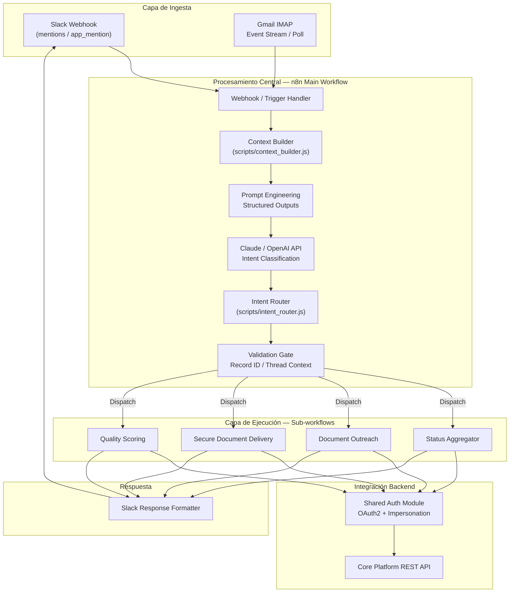
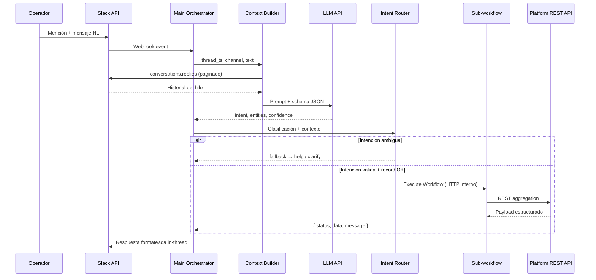

# AI Operations Copilot: Multi-Channel Orchestration & Intent Routing Engine

Sistema de orquestación asíncrono que centraliza la ingesta de eventos distribuidos (Slack, Gmail), utiliza LLMs (Claude/OpenAI) para la clasificación semántica de intenciones y distribuye la carga de trabajo hacia sub-workflows especializados mediante APIs REST.

**Rol:** Integration & Automation Engineer · Junior/Mid-level  
**Paradigma:** Workflows as Code · Parent/Child orchestration · Structured LLM outputs  
**Entorno:** Producción · 25+ operadores · Ingesta dual (reactiva + proactiva)

---

## Resumen técnico

Este repositorio documenta un **motor de orquestación operacional** donde n8n actúa como capa de ejecución distribuida, no como sustituto de la lógica de negocio. La inteligencia de enrutamiento, validación de contexto y recuperación de hilos conversacionales reside en **JavaScript puro** (`/scripts`), invocado desde nodos Code con contratos de entrada/salida explícitos.

| Capa | Responsabilidad |
|------|-----------------|
| Ingesta | Webhooks Slack · polling/stream Gmail |
| Clasificación | LLM con JSON Schema enforced |
| Orquestación | Router determinista + sub-workflows |
| Integración | OAuth · REST · impersonation |
| Salida | Formato unificado Slack (Block Kit) |

---

## Arquitectura del Sistema



### Flujo secuencial (Slack)



---

## Desafíos de Ingeniería Resueltos

### 1. Manejo de Contexto Asíncrono (Context Recovery)

Los operadores no repiten el identificador de registro en cada mensaje; el contexto vive en el **hilo de Slack**. El módulo `context_builder.js` implementa:

1. **Extracción del `thread_ts`** desde el evento webhook entrante.
2. **Llamadas paginadas** a `conversations.replies` con cursor (`cursor` / `next_cursor`) hasta agotar el historial relevante o alcanzar un límite de tokens configurado.
3. **Normalización del hilo** — filtrado de mensajes del bot, deduplicación, orden cronológico.
4. **Extracción de entidades** — regex + heurísticas sobre URLs de la plataforma central (`/records/{id}`) embebidas en mensajes previos.
5. **Ventana de contexto para el LLM** — truncado inteligente (mensajes recientes + mensajes que contienen links de registro).

**Resultado:** El LLM recibe contexto suficiente para clasificar intención **sin** exigir re-input manual al operador.

### 2. Garantía de Salidas Estructuradas (Structured Outputs)

Los nodos downstream (router, validator, Execute Workflow) requieren JSON parseable — las respuestas en prosa rompen el pipeline.

**Implementación:**

- Schema JSON estricto embebido en el prompt (`intent`, `confidence`, `entities`, `requires_record`).
- Post-procesamiento en Code node: `JSON.parse` con try/catch + validación de campos obligatorios.
- **Re-prompt automático** (1 retry) si el parse falla, con instrucción de corrección de formato.
- Rechazo explícito (`status: invalid_llm_output`) si tras retry persiste el fallo — evita propagación silenciosa de errores.

```json
{
  "intent": "status_check | outreach | secure_send | quality | help | unknown",
  "confidence": 0.0,
  "entities": { "record_id": null, "contact_email": null },
  "requires_record": true
}
```

### 3. Fuzzy Matching & Fallbacks

Cuando `confidence < umbral` o `intent === unknown`:

| Estrategia | Acción |
|------------|--------|
| Umbral bajo + entidades parciales | Fuzzy match contra API de búsqueda de registros |
| Sin match | Respuesta `help` con comandos válidos |
| Email triage (rama Gmail) | Extracción LLM → match fonético/parcial sobre campos indexados |
| Error transitorio API | Retry con backoff exponencial (3 intentos) |
| Fallo definitivo | Alerta estructurada al canal de ops + log de ejecución |

El router **nunca** despacha a sub-workflows costosos sin contexto de registro validado (`validation gate` previo al dispatch).

---

## Stack tecnológico

| Categoría | Tecnologías |
|-----------|-------------|
| Orquestación | n8n (self-hosted) |
| Lógica de negocio | JavaScript (Node.js runtime) |
| IA aplicada | Claude (Anthropic) · OpenAI (transferable) |
| Integraciones | Slack API · Gmail API · REST · OAuth2 |
| Patrones | Parent/Child workflows · Webhooks · Structured outputs |

---

## Estructura del repositorio

```text
ai-operations-copilot-n8n/
├── README.md
├── workflows/
│   └── main_orchestrator.json      # Exportación n8n — workflow principal (sanitizado)
├── scripts/
│   ├── intent_router.js            # Enrutamiento determinista post-LLM
│   └── context_builder.js          # Recuperación paginada de hilos Slack
└── docs/
    └── intent-schema.json            # Schema de salida LLM (referencia)
```

> **Nota de seguridad:** Los exports en `/workflows` deben estar sanitizados (sin credenciales, URLs internas ni PII). Ver política de publicación antes de commit.

---

## Métricas de impacto (producción)

| Métrica | Valor |
|---------|-------|
| Tiempo de consulta de estado | 3–5 min → ~10 seg |
| Operadores servidos | 25+ |
| Rutas de intent | 8 |
| Canales de ingesta | Slack + Gmail |

---

## Licencia

MIT — Case study anonimizado con fines de portfolio técnico.
