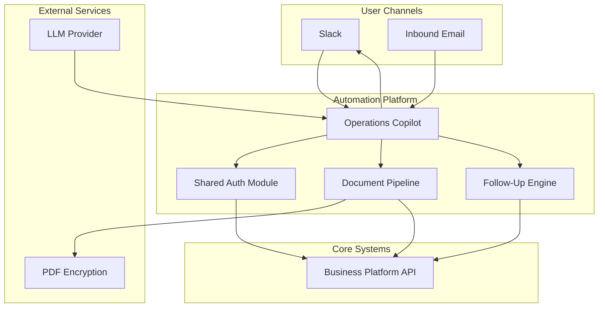
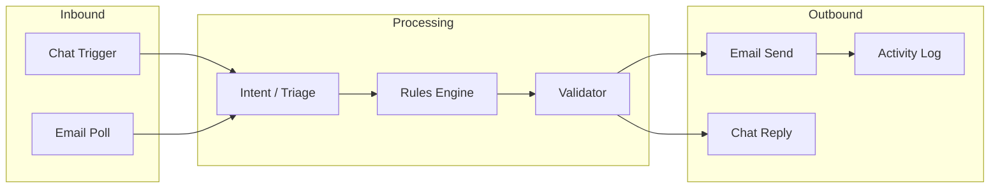

# System Architecture Overview

Industry-agnostic architecture for a multi-module operations automation platform.

## Platform Stack

## Design Principles

1. **Modular sub-workflows** — Domain logic isolated; parent orchestrator stays thin
2. **Shared authentication** — Single auth module; impersonation for user-scoped operations
3. **LLM + deterministic hybrid** — AI for ambiguity; code for correctness
4. **Explicit I/O contracts** — Sub-workflows accept structured inputs; return structured status
5. **Validation before side effects** — No emails sent without payload validation
6. **Audit by default** — Activity logging built into delivery pipelines

## Integration Map

## Reusable Patterns

| Pattern | Use Case |
|---------|----------|
| Intent router + sub-workflows | Any multi-action ops copilot |
| Thread context recovery | Chat bots requiring persistent record links |
| Pre-send validation gate | Any automated outbound communication |
| Impersonation auth | Central automation acting on behalf of many users |
| Rules engine in code | Complex branching better maintained outside visual flows |
| Fuzzy entity matching | Email/chat → CRM record linking |

## Deployment

- Automation engine: self-hosted n8n instance
- Credentials: platform vault (no plaintext secrets in workflows)
- Observability: execution IDs propagated via HTTP headers
- Error handling: retry on transient failures; continue-on-error with structured outcomes
