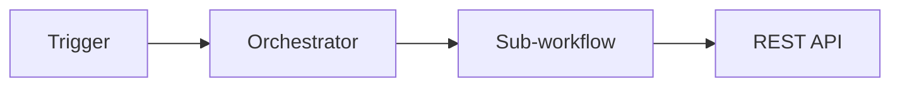

# README Template — Engineering Portfolio Repositories

Use this structure for all automation / integration project repos.

---

```markdown
# [Project Name]

> One-line value proposition — what the system does and for whom.

[](LICENSE)
[](https://github.com/GianMs-Tb)

---

## Overview

2–3 sentences: problem, solution, production context (anonymized).
Do NOT mention client names or industry-specific terms.

## Problem

- Bullet: operational pain point
- Bullet: scale / team size (e.g. 25+ operators)
- Bullet: risk or cost of manual process

## Solution

- Bullet: architecture approach
- Bullet: key integrations
- Bullet: guardrails / validation

## Architecture

<!-- Mermaid diagram — required -->



## Engineering Highlights

| Pattern | Implementation |
|---------|----------------|
| Pattern name | How you built it |

## Integrations

| System | Role |
|--------|------|
| Slack API | Reactive command ingestion |
| REST API | Record aggregation |

## Repository Structure

```text
├── README.md
├── docs/
├── src/           # Extracted JavaScript modules
├── workflows/     # Sanitized n8n exports
└── assets/        # Anonymized diagrams
```

## Impact (Production)

| Metric | Before | After |
|--------|--------|-------|
| Status lookup | 3–5 min | ~10 sec |

## Tech Stack

`n8n` · `JavaScript` · `Node.js` · `REST APIs` · `OAuth` · `[others]`

## My Role

- Architected ...
- Implemented ...
- Deployed and maintained in production

## Security & Anonymization

- All workflow exports are sanitized (no credentials, IDs, or PII)
- Screenshots are anonymized
- Industry context generalized

## Related Projects

- [AI Operations Copilot](https://github.com/GianMs-Tb/ai-operations-copilot)
- [Portfolio](https://github.com/GianMs-Tb/portfolio)

## License

MIT — see [LICENSE](LICENSE).
```

---

## Description field (GitHub repo settings)

Max 350 characters. Format:

```
[What it does] — [key pattern]. [Stack hint]. Production automation system (anonymized case study).
```

## Topics (always include 5–10)

**Core:** `automation`, `integration`, `workflow-orchestration`, `n8n`, `rest-api`

**Per project add 2–4 from:** `oauth`, `webhooks`, `slack-api`, `gmail-api`, `claude-ai`, `openai`, `nodejs`, `javascript`, `validation`, `ai-workflow`, `backend`, `postgresql`, `supabase`

## Branch naming

- Default: `main`
- Avoid: `master` on new repos

## Commit message convention

```
type(scope): description

feat(copilot): add intent classifier module
docs(readme): add architecture diagram
chore(workflows): sanitize n8n export
```

Types: `feat`, `fix`, `docs`, `refactor`, `chore`, `test`
