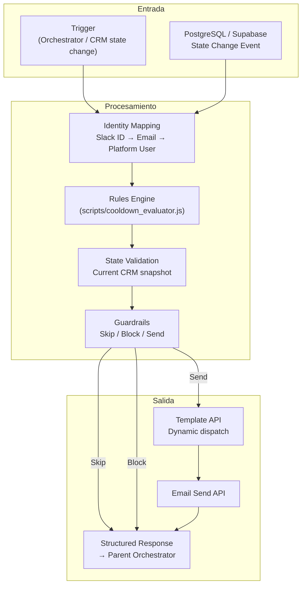
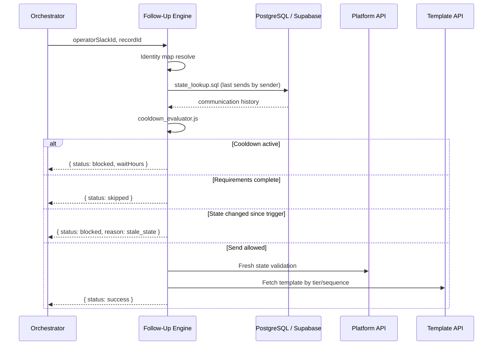

# Intelligent Follow-Up Engine: State Validation & Rules-Driven Communication

Motor de eventos con lógica de estados diseñado para automatizar flujos de comunicación y seguimiento B2B, regulado por políticas estrictas de frecuencia (Cooldown Logic), mapeo de identidades multi-plataforma y ejecución determinista basada en reglas de negocio.

**Rol:** Integration & Automation Engineer · Junior/Mid-level  
**Paradigma:** Rules-as-Code · State machine · Policy enforcement  
**Entorno:** Producción · Sub-workflow del orchestrator · 25+ operadores

---

## Resumen técnico

La lógica de negocio **no** está distribuida en decenas de nodos IF visuales. Está centralizada en JavaScript (`/scripts`) y SQL (`/queries`), invocada desde un workflow n8n delgado que actúa como capa de integración.

| Componente | Función |
|------------|---------|
| Identity Mapping | Slack ID ↔ Platform User ↔ Contact |
| Rules Engine | Tier · sequence · template selection |
| Cooldown Evaluator | PostgreSQL/Supabase state lookup |
| Guardrails | Skip · Block · Send |

---

## Arquitectura del Sistema



### Evaluación de cooldown (SQL + JS)



---

## Desafíos de Ingeniería Resueltos

### 1. Lógica de Enfriamiento (Cooldown Logic)

**Problema:** Sin estado persistente, cada ejecución del workflow trataría el envío como independiente → spam al stakeholder.

**Solución:**

- Tabla `communication_log` en PostgreSQL/Supabase con índice compuesto `(record_id, sender_id, sent_at)`.
- Query parametrizada en `/queries/state_lookup.sql` — últimos envíos por remitente en ventana de 48h (configurable).
- `cooldown_evaluator.js` calcula `waitHours` restantes y retorna status `blocked` con mensaje accionable para el formatter Slack upstream.

**Política:** Un operador no puede re-enviar al mismo registro dentro de la ventana; operadores distintos tienen cooldown **per-sender**, no global.

### 2. Mapeo de Identidades Descentralizadas (Identity Mapping)

**Problema:** El operador interactúa via Slack; la plataforma central usa `userId` distinto; el CRM puede indexar por email.

**Solución:**

- Mapa de identidad en Code node (v1) con path de migración a tabla Supabase.
- Resolución en cadena: `slackUserId` → `platformUserId` + `role` + `defaultAliasId`.
- Validación de rol antes de impersonation — operadores sin permiso de envío abortan con error estructurado.

### 3. Guardrails de Ejecución

**Problema:** El estado del registro puede cambiar entre el trigger y el envío (race condition).

**Solución:**

- **Re-fetch** del estado actual del CRM inmediatamente antes del send.
- Comparación: `requirements_pending_count` al trigger vs. al momento del envío.
- Si el cliente completó requisitos en el intervalo → `status: skipped` (no send).
- Si el registro cambió de tier/variant → re-evaluar template antes de despachar.

---

## Stack tecnológico

| Categoría | Tecnologías |
|-----------|-------------|
| Orquestación | n8n (sub-workflow) |
| Lógica | JavaScript · SQL |
| Estado | PostgreSQL · Supabase |
| Integraciones | REST · Template API · Email API · Slack (via parent) |
| Auth | OAuth2 impersonation |

---

## Estructura del repositorio

```text
intelligent-follow-up-engine/
├── README.md
├── workflows/
│   └── follow_up_core.json           # Exportación n8n sanitizada
├── queries/
│   └── state_lookup.sql              # Lookup de historial de comunicaciones
└── scripts/
    └── cooldown_evaluator.js         # Evaluación de ventana 48h + rules
```

---

## Métricas de impacto (producción)

| Métrica | Valor |
|---------|-------|
| Tiempo ahorrado por outreach | 5–8 min |
| Cooldown policy | 48h enforced |
| Rutas de template | 4 dinámicas |
| Operadores servidos | 25+ |

---

## Licencia

MIT — Case study anonimizado con fines de portfolio técnico.
