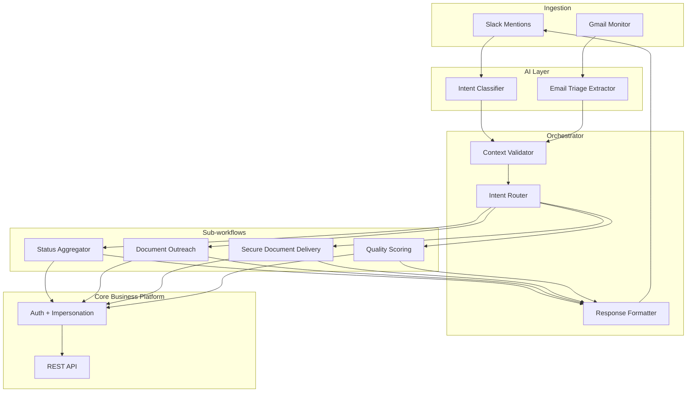
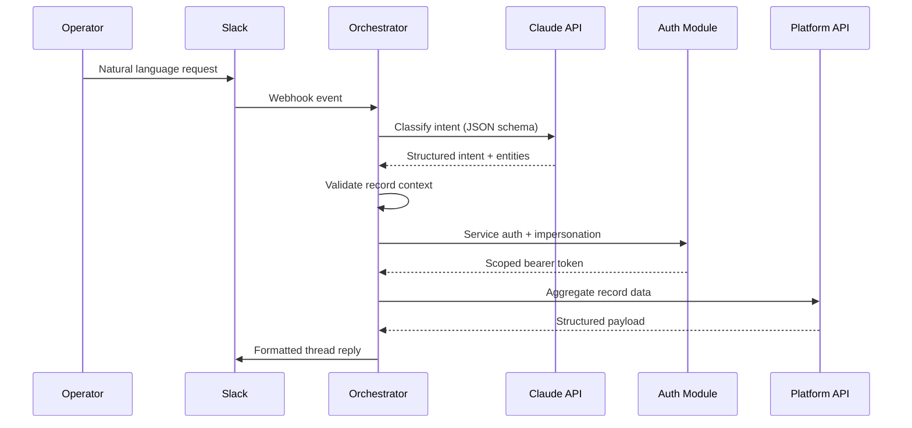

# AI Operations Copilot

> Production multi-channel operations orchestrator — LLM intent routing, Slack/Gmail dual ingestion, sub-workflow dispatch, and structured response formatting.

[](https://github.com/GianMs-Tb)

**Type:** Integration system · Distributed orchestration · AI-assisted routing  
**Environment:** Production · 25+ operators · Dual-channel ingestion  
**Execution layer:** n8n (orchestration) + custom JavaScript (business logic)

---

## Executive Summary

Operations teams running high-volume business processes lose hours daily to context-switching between chat, email, and a core business platform. This system is a **backend-connected operations copilot** that:

1. Accepts natural-language commands via Slack
2. Classifies intent with **structured LLM output** (Claude)
3. Validates record context from message or thread history
4. Routes to specialized **sub-workflow modules**
5. Monitors inbound email proactively and surfaces alerts

**Result:** Status lookups drop from **3–5 minutes to ~10 seconds**.

---

## Business Problem

| Pain point | Impact |
|------------|--------|
| Repeated manual platform lookups | 3–5 min per status check × dozens daily |
| Context-switching Slack ↔ email ↔ CRM | Inconsistent follow-up, operator fatigue |
| Inbox triage lag | Stakeholder updates sit unprocessed |
| No unified command interface | Steep onboarding for new operators |

---

## Solution

Hybrid **AI + deterministic** architecture:

- **LLM layer** — intent classification, email entity extraction (structured JSON)
- **Code layer** — validation gates, routing, fuzzy matching, response formatting
- **Integration layer** — OAuth service auth, user impersonation, REST aggregation
- **Orchestration layer** — parent workflow + composable sub-workflows with explicit I/O contracts

---

## Architecture

### System context



### Integration map



### Intent routing (8 paths)

| Intent | Module | Requires record ID |
|--------|--------|-------------------|
| Status check | Status Aggregator | Yes |
| Document outreach | Follow-Up Engine | Yes |
| Secure send | Document Pipeline | Yes |
| Quality score | Quality Scoring | Yes |
| Help / unknown | Formatter (static) | No |
| Email triage | Proactive alert | Fuzzy match |

---

## Technologies

| Layer | Technology |
|-------|------------|
| Orchestration | n8n (sub-workflow composition) |
| Business logic | JavaScript (Node.js runtime in Code nodes) |
| AI | Anthropic Claude — structured JSON output |
| Chat | Slack API — mentions, threads, blocks |
| Email | Gmail API — poll, parse, extract |
| Auth | OAuth 2.0 service account + user impersonation |
| Platform | REST API — records, files, activity logs |

---

## Business Impact

| Metric | Before | After |
|--------|--------|-------|
| Status lookup | 3–5 min | ~10 sec |
| Operators served | — | 25+ |
| Routed intent paths | — | 8 |
| Ingestion channels | — | Slack + Email |

---

## Repository Structure

```text
ai-operations-copilot/
├── README.md
├── LICENSE
├── docs/
│   ├── architecture.md
│   ├── integration-contracts.md
│   └── intent-taxonomy.md
├── src/
│   ├── intent/
│   │   ├── classify-intent.schema.json
│   │   └── parse-llm-response.js
│   ├── context/
│   │   ├── extract-record-from-thread.js
│   │   └── validate-record-context.js
│   ├── routing/
│   │   └── intent-router.js
│   ├── email/
│   │   ├── fuzzy-record-match.js
│   │   └── triage-extractor.js
│   └── formatting/
│       └── slack-response-builder.js
├── workflows/
│   ├── orchestrator.sanitized.json
│   ├── auth-module.sanitized.json
│   └── sub-workflows/
└── assets/
    └── diagrams/
```

---

## Recommended Screenshots

1. **Orchestrator topology** — full workflow (anonymized node names)
2. **Intent classifier Code node** — JSON schema enforcement
3. **Router switch** — 8 intent branches
4. **Thread context recovery** — Slack thread scan logic
5. **Email triage branch** — Gmail → fuzzy match → alert
6. **Sub-workflow Execute Workflow nodes** — I/O mapping
7. **Error handling** — retry + structured failure response

---

## Extracted JavaScript Modules

See `src/` — reference implementations mirroring production Code node logic.  
When you add real exports, map each Code node → corresponding module.

| Module | Responsibility |
|--------|----------------|
| `parse-llm-response.js` | Parse + validate Claude JSON output |
| `validate-record-context.js` | Fail-fast if record ID missing |
| `extract-record-from-thread.js` | Scan Slack thread for platform links |
| `intent-router.js` | Map intent enum → sub-workflow + payload |
| `fuzzy-record-match.js` | Match email entities to platform records |
| `slack-response-builder.js` | Unified Block Kit formatter |

---

## Sub-workflow I/O Contract

```typescript
// Input (from parent orchestrator)
interface CopilotModuleInput {
  recordId: string
  operatorSlackId: string
  operatorPlatformUserId: string
  intent: string
  threadTs?: string
  channelId?: string
}

// Output (to parent formatter)
interface CopilotModuleOutput {
  status: 'success' | 'skipped' | 'blocked' | 'error'
  message: string
  data?: Record<string, unknown>
  errorCode?: string
}
```

---

## Future Improvements

1. **Migrate identity map** from inline JS → PostgreSQL/Supabase config store
2. **Replace Gmail poll** with push notifications (Pub/Sub webhook)
3. **Intent classifier microservice** — Node.js API decoupled from n8n
4. **Observability** — OpenTelemetry traces across sub-workflow boundaries
5. **Rate limiting** — per-operator API quota guardrails
6. **A/B prompt versioning** — intent taxonomy changes without workflow edits

---

## Security & Anonymization

All workflow exports in `/workflows` are sanitized. No credentials, internal URLs, or PII.  
Re-link credentials locally before import.

---

## License

MIT
