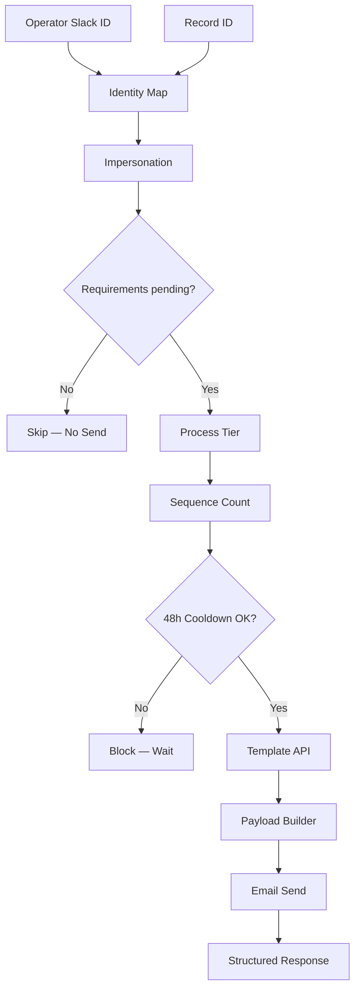
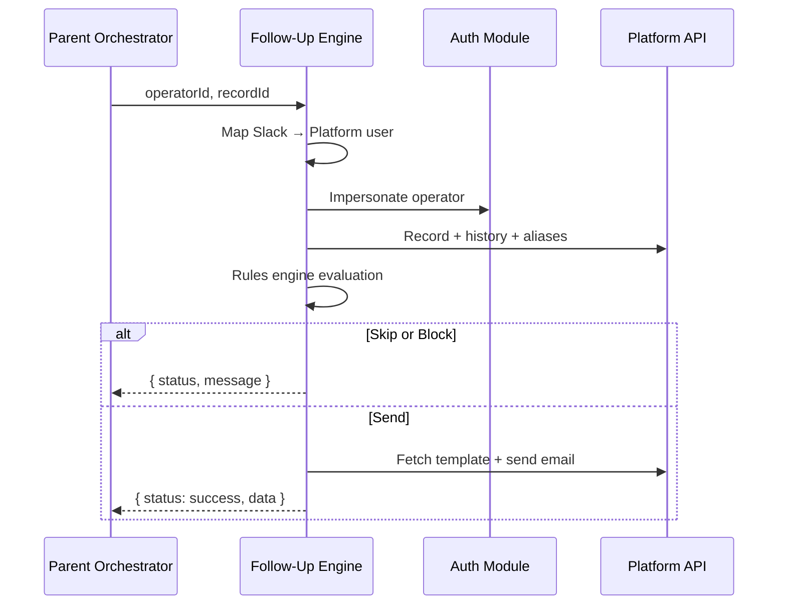

# Intelligent Follow-Up Engine

> Policy-aware stakeholder outreach — cross-system identity mapping, JavaScript rules engine, template resolution, and 48-hour cooldown guardrails.

[](https://github.com/GianMs-Tb)

**Type:** Rules engine · Policy enforcement · Sub-workflow module  
**Environment:** Production · 25+ operators · Orchestrator-integrated  
**Execution layer:** n8n + JavaScript rules (not visual branching)

---

## Executive Summary

Document collection phases require operators to pick templates, check communication history, and respect cooldown policies — **5–8 min per outreach**, high spam risk without guardrails.

This engine resolves **chat identity → platform user**, evaluates **process state + history**, selects **official templates** by tier/sequence, enforces **48h cooldown**, and returns **structured status** to the parent orchestrator.

---

## Business Problem

| Pain point | Impact |
|------------|--------|
| Wrong template for process variant | Stakeholder confusion |
| Duplicate outreach | Trust erosion |
| Manual history checks | 5–8 min per send |
| No cooldown enforcement | Policy violations |

---

## Solution

**Rules-in-code** architecture:

1. Map Slack operator → platform user (identity layer)
2. Impersonate operator for scoped API access
3. Fetch record, requirements, email history
4. Rules engine: requirements → tier → sequence → cooldown
5. Guardrails: **skip** (complete) or **block** (cooldown)
6. Fetch official template → build payload → send
7. Return structured `{ status, message, data }` to parent

---

## Architecture





---

## Technologies

| Layer | Technology |
|-------|------------|
| Orchestration | n8n sub-workflow |
| Rules | JavaScript — tier, sequence, cooldown |
| Identity | Cross-system user map (Slack ↔ Platform) |
| Auth | OAuth impersonation |
| APIs | Records, templates, email, communication logs |
| Integration | Slack (via parent formatter) |

---

## Business Impact

| Metric | Value |
|--------|-------|
| Time saved per outreach | 5–8 min |
| Cooldown policy | 48h enforced |
| Template routes | 4 dynamic paths |
| Operators served | 25+ |

---

## Repository Structure

```text
intelligent-followup-engine/
├── README.md
├── docs/
│   ├── rules-engine.md
│   └── io-contract.md
├── src/
│   ├── identity/
│   │   └── slack-to-platform-map.js
│   ├── rules/
│   │   ├── template-resolver.js
│   │   └── cooldown-validator.js
│   └── response/
│       └── structured-status.js
├── workflows/
│   └── follow-up-engine.sanitized.json
└── assets/diagrams/
```

---

## Recommended Screenshots

1. Sub-workflow input/output mapping (Execute Workflow trigger)
2. Identity map Code node (anonymized user table)
3. Rules engine — single Code node vs scattered IF nodes
4. Cooldown calculation from communication logs
5. Skip / Block / Send three-way branch
6. Template API fetch + payload assembly
7. Structured JSON response to parent

---

## Extracted JavaScript Modules

| Module | Responsibility |
|--------|----------------|
| `slack-to-platform-map.js` | Resolve operator identity + role |
| `template-resolver.js` | Tier threshold + sequence → template ID |
| `cooldown-validator.js` | Per-sender 48h window from history |
| `structured-status.js` | Normalized output for upstream formatter |

---

## Sub-workflow I/O Contract

```typescript
// Input
interface FollowUpInput {
  recordId: string
  operatorSlackId: string
}

// Output
interface FollowUpOutput {
  status: 'success' | 'skipped' | 'blocked' | 'error'
  message: string
  templateId?: string
  waitHours?: number
}
```

---

## Future Improvements

1. Externalize identity map → Supabase table with admin UI
2. Configurable cooldown per process tier (not hardcoded 48h)
3. Unit test suite for rules engine (Jest)
4. Webhook callback instead of polling communication logs
5. ML-assisted template suggestion (optional layer on rules)

---

MIT License
