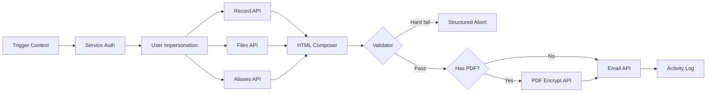
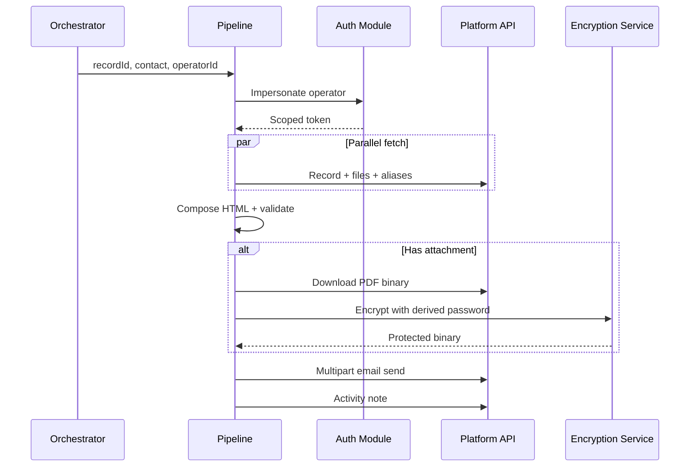

# Secure Document Delivery Pipeline

> End-to-end secure document automation — OAuth impersonation, dynamic HTML composition, PDF encryption, pre-send validation gates, and audit logging.

[](https://github.com/GianMs-Tb)

**Type:** ETL pipeline · Security-critical integration · Transactional delivery  
**Environment:** Production · Triggered by orchestrator or manual ops  
**Execution layer:** n8n + custom JavaScript validation & binary processing

---

## Executive Summary

Operations teams send sensitive PDF reports to external stakeholders. Manual workflow: download → password-protect → compose email → select sender alias → log activity (**10–15 min/send**).

This pipeline automates the full chain with **user impersonation**, **dynamic HTML generation**, **third-party PDF encryption**, **hard/soft validation tiers**, and **automatic audit trails**.

---

## Business Problem

| Pain point | Risk |
|------------|------|
| Unprotected PDF attachments | Compliance / privacy exposure |
| Manual 10–15 min send process | Scale bottleneck, human error |
| Wrong sender alias | Brand / partner trust issues |
| Missing activity logs | Audit gaps |

---

## Solution

Linear **ETL + security + delivery** pipeline:

1. Receive structured trigger context (record, contact, operator)
2. Authenticate → impersonate operator for scoped API access
3. Parallel data aggregation (record, files, aliases, branding)
4. Compose dynamic HTML email body
5. **Validation gate** — hard abort vs soft warn
6. Conditional PDF branch: download → encrypt → multipart prepare
7. Send via platform email API
8. Write activity note with execution trace

---

## Architecture





---

## Technologies

| Layer | Technology |
|-------|------------|
| Orchestration | n8n |
| Logic | JavaScript — validation, HTML, password derivation |
| Auth | OAuth Bearer + user impersonation |
| APIs | REST — records, files, email, notes |
| Security | Third-party PDF encryption API |
| Binary | Download → transform → multipart upload |

---

## Business Impact

| Metric | Value |
|--------|-------|
| Time saved per send | 10–15 min |
| PDF password protection | 100% automated |
| Pre-send validation | Hard abort on missing fields |
| Audit trail | Auto-logged per send |

---

## Repository Structure

```text
secure-document-delivery-pipeline/
├── README.md
├── docs/
│   ├── architecture.md
│   └── validation-rules.md
├── src/
│   ├── auth/
│   │   └── normalize-token-response.js
│   ├── compose/
│   │   └── html-email-builder.js
│   ├── validation/
│   │   └── pre-send-validator.js
│   ├── security/
│   │   └── password-derivation.js
│   └── binary/
│       └── prepare-multipart-attachment.js
├── workflows/
│   └── pipeline.sanitized.json
└── assets/diagrams/
```

---

## Recommended Screenshots

1. Pipeline linear flow (Auth → Data → Validate → Send)
2. Parallel API aggregation branch
3. Validator Code node — hard vs soft failure output
4. PDF encrypt conditional branch
5. Multipart upload configuration (MIME, filename)
6. Activity log write node
7. Error path — structured abort to upstream Slack formatter

---

## Extracted JavaScript Modules

| Module | Responsibility |
|--------|----------------|
| `pre-send-validator.js` | Hard/soft field validation |
| `password-derivation.js` | Multi-tier password chain with fallbacks |
| `html-email-builder.js` | Dynamic HTML from record metrics |
| `normalize-token-response.js` | Normalize inconsistent auth API shapes |
| `prepare-multipart-attachment.js` | Binary metadata repair for upload |

---

## Future Improvements

1. **Queue-based retry** for encryption API transient failures
2. **Template versioning** — HTML composer driven by config, not inline strings
3. **Supabase audit store** — duplicate activity logs for analytics
4. **Virus scan hook** before send
5. **Dedicated Node.js microservice** — decouple from n8n for high volume

---

## Security & Anonymization

Sanitized exports only. Credentials removed. Internal URLs replaced with `api.example.com`.

MIT License
