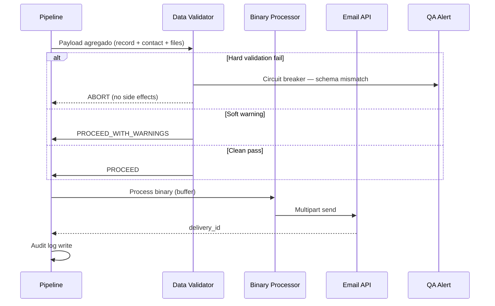

# Secure Document Delivery Pipeline: Automated ETL & Binary Processing Workflow

Pipeline automatizado de grado empresarial para la extracción, transformación y distribución segura de documentos financieros/operativos, implementando compresión binaria, inyección dinámica de HTML a PDF, encriptación criptográfica y compuertas de validación de datos.

**Rol:** Integration & Automation Engineer · Junior/Mid-level  
**Paradigma:** ETL tolerante a fallos · Validation gates · Binary-safe processing  
**Entorno:** Producción · Triggered by orchestrator · Audit-by-default

---

## Resumen técnico

Pipeline lineal con **compuertas de validación** previas a cualquier efecto secundario (envío de email, escritura en storage). La lógica de negocio — validación de esquema, derivación de contraseñas, composición HTML — vive en `/scripts`, no en ramas visuales del workflow.

| Fase | Responsabilidad |
|------|-----------------|
| Extract | REST + OAuth2 · impersonation |
| Transform | JSON → HTML dinámico |
| Process | HTML→PDF · encrypt · buffer |
| Load | Multipart upload · audit log |

---

## Arquitectura del Sistema

```mermaid
flowchart LR
    subgraph Extract["Extracción"]
        TR["Trigger Context<br/>(record, operator, contact)"]
        OAUTH["OAuth2 Service Auth"]
        IMP["User Impersonation<br/>Token efímero"]
        RAPI["Record REST API"]
        FAPI["Files REST API"]
    end

    subgraph Transform["Transformación ETL"]
        MAP["JSON Payload Mapper"]
        HTML["Dynamic HTML Composer<br/>(templates/invoice_template.html)"]
        VAL["Validation Gate<br/>(scripts/data_validator.js)"]
    end

    subgraph Binary["Procesamiento Binario"]
        DL["PDF Download<br/>(stream/buffer)"]
        ENC["Encryption API<br/>Password-protected PDF"]
        BUF["Buffer Metadata Repair<br/>MIME, filename"]
    end

    subgraph Load["Carga & Auditoría"]
        MU["Multipart Upload"]
        AUD["Audit Log / DB Write"]
        CB["Circuit Breaker Alert<br/>(QA channel)"]
    end

    TR --> OAUTH --> IMP
    IMP --> RAPI & FAPI
    RAPI & FAPI --> MAP --> HTML --> VAL
    VAL -->|Hard fail| CB
    VAL -->|Pass| DL
    DL --> ENC --> BUF --> MU --> AUD
```



### Secuencia de validación (Circuit Breaker)



---

## Desafíos de Ingeniería Resueltos

### 1. Compuertas de Validación (Validation Gates)

El módulo `data_validator.js` implementa un **Circuit Breaker** semántico:

- **Hard failures** — campos obligatorios ausentes, email inválido, record ID nulo → **abort inmediato**, sin envío, alerta al canal QA con payload de diagnóstico (sanitizado).
- **Soft warnings** — adjunto sin contraseña derivada, campo opcional vacío → log + continuación controlada.
- **Schema validation** — contrato JSON documentado; desviaciones bloquean el flujo antes de consumir APIs de encriptación (costosas).

**Principio:** Ningún email sale del pipeline sin pasar la compuerta. Fail closed, not fail open.

### 2. Gestión de Identidades (Impersonation Patterns)

Los emails deben enviarse **en nombre del operador** (alias corporativo), no desde cuenta de sistema genérica.

**Implementación:**

1. Auth de servicio (client credentials / refresh token en vault de n8n).
2. Intercambio por **token efímero de impersonation** scoped al `operatorUserId`.
3. Normalización de respuesta auth (diferentes shapes según endpoint).
4. Token nunca persistido en logs ni exports de workflow.

**Resultado:** Auditoría correcta en plataforma central + identidad de remitente coherente con política de negocio.

### 3. Procesamiento Eficiente de Binarios

Evitar desbordamiento de memoria en instancias n8n con límites de heap:

- Descarga de PDF como **binary buffer** nativo (no string Base64 intermedio innecesario).
- Encriptación vía API externa con **stream/chunk** cuando el archivo supera umbral configurable.
- Reparación explícita de metadata: `Content-Type: application/pdf`, `filename` con extensión.
- Multipart upload con boundary correcto — validación pre-flight del tamaño total del payload.

---

## Stack tecnológico

| Categoría | Tecnologías |
|-----------|-------------|
| Orquestación | n8n |
| Lógica | JavaScript (Node.js) |
| Auth | OAuth2 · Bearer · Impersonation |
| APIs | REST · Multipart |
| Seguridad | PDF encryption API |
| Plantillas | HTML dinámico |

---

## Estructura del repositorio

```text
secure-document-delivery-pipeline/
├── README.md
├── workflows/
│   └── delivery_pipeline.json        # Exportación n8n sanitizada
├── templates/
│   └── invoice_template.html         # Plantilla HTML base (anonimizada)
└── scripts/
    └── data_validator.js             # Circuit breaker + schema validation
```

---

## Métricas de impacto (producción)

| Métrica | Valor |
|---------|-------|
| Tiempo ahorrado por envío | 10–15 min |
| Protección PDF | 100% automatizada |
| Pre-send validation | Abort antes de envío |
| Audit trail | Auto-registrado |

---

## Licencia

MIT — Case study anonimizado con fines de portfolio técnico.
